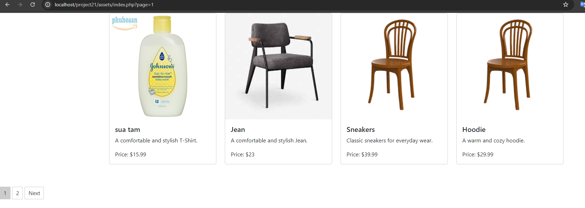

# Product Listing Web Application

## Mô tả
Đây là một ứng dụng web đơn giản cho phép hiển thị danh sách sản phẩm trên nhiều trang và phân trang cho người dùng. Ứng dụng này được viết bằng PHP và sử dụng Bootstrap để thiết kế giao diện người dùng.

## Công việc thực hiện
- **products.php**: File này chứa dữ liệu mẫu về các sản phẩm, bao gồm id, tên, giá, mô tả và đường dẫn đến ảnh của mỗi sản phẩm.
- **product_list.php**: Trang này hiển thị danh sách sản phẩm trên nhiều trang và phân trang cho người dùng. Các sản phẩm được hiển thị dưới dạng các thẻ card và mỗi trang chứa 4 sản phẩm.
- **styles.css**: File CSS này chứa kiểu dáng cho giao diện của trang web, bao gồm cả phân trang và hiển thị sản phẩm.
- **README.md**: File này cung cấp hướng dẫn và mô tả về công việc đã thực hiện.

## Cách sử dụng
1. **Tải về mã nguồn**: Clone repository này về máy của bạn bằng cách chạy lệnh sau trong terminal:

## Sau khi thực hiện:
- ## Kết quả

